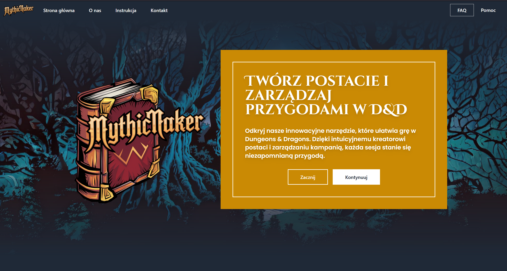

# 🔥🔥🔥🔥 MythicMaker 🔥🔥🔥🔥



### Description

MythicMaker is a website designed for RPG (role-playing game) enthusiasts who enjoy creating characters. The site allows users to create accounts where they can design and manage their characters. Each character profile includes detailed information such as name, race, biography, appearance, and a picture (uploaded by the user or selected from a database).

Users can edit their character's stats, such as health points, strength, dexterity, constitution, intelligence, wisdom, and charisma. There’s also an option to add experience points – once a certain threshold is reached, the player receives a notification about the opportunity to upgrade one of the character's attributes.

The website also provides a view of the character's current equipment, allowing for better character management.

## ⚙️ Tech Stack

🔹 **Frontend**: React, TypeScript, TailwindCSS, SASS, CSS  
🔹 **Backend**: Firebase (authentication, database), Web3Forms

## 🖥️ System Requirements

✅ **Node.js** (version 16+ recommended)  
✅ **npm** (version 8+ recommended) or **Yarn**  
✅ **Git** (optional, for cloning the repository)

## 📥 Installation

### Download the Project

🔹 Clone the repository:

```bash
git clone https://github.com/Jakubba/MythicMaker
cd mythicmaker
```

🔹 Alternatively, download the ZIP file, extract it, and open the project folder.

### Open the Project

Use a code editor like VSCode, Sublime Text, or WebStorm.

🔹 In VSCode:

    Right-click the project folder and select "Open with Code", or
    Open VSCode and use File > Open Folder.

### Open the Project

If using Yarn:

```
  yarn install
```

Or if using npm:

```
  npm install
```

### Open the Project

To start the application, run one of the following commands:

For Yarn:

```
  yarn dev
```

For npm:

```
  npm run dev
```

### Now you can start using MythicMaker and bring your RPG characters to life! 🎲

## 📜 License

This project is licensed under the MIT License.

## 🎭 Author

Jacob B
